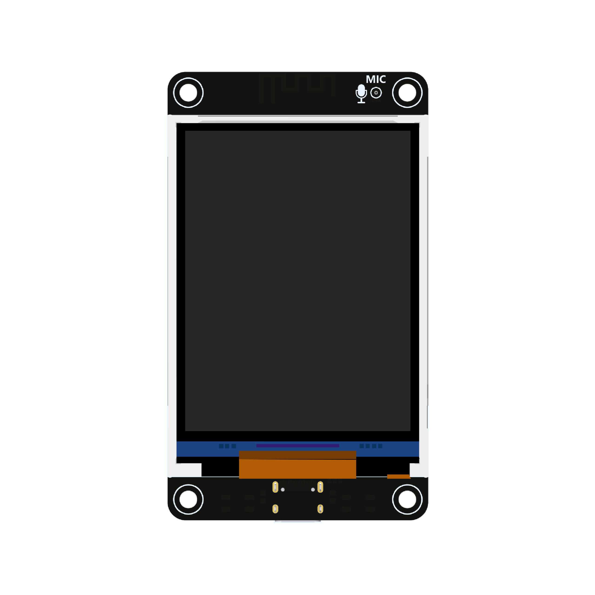
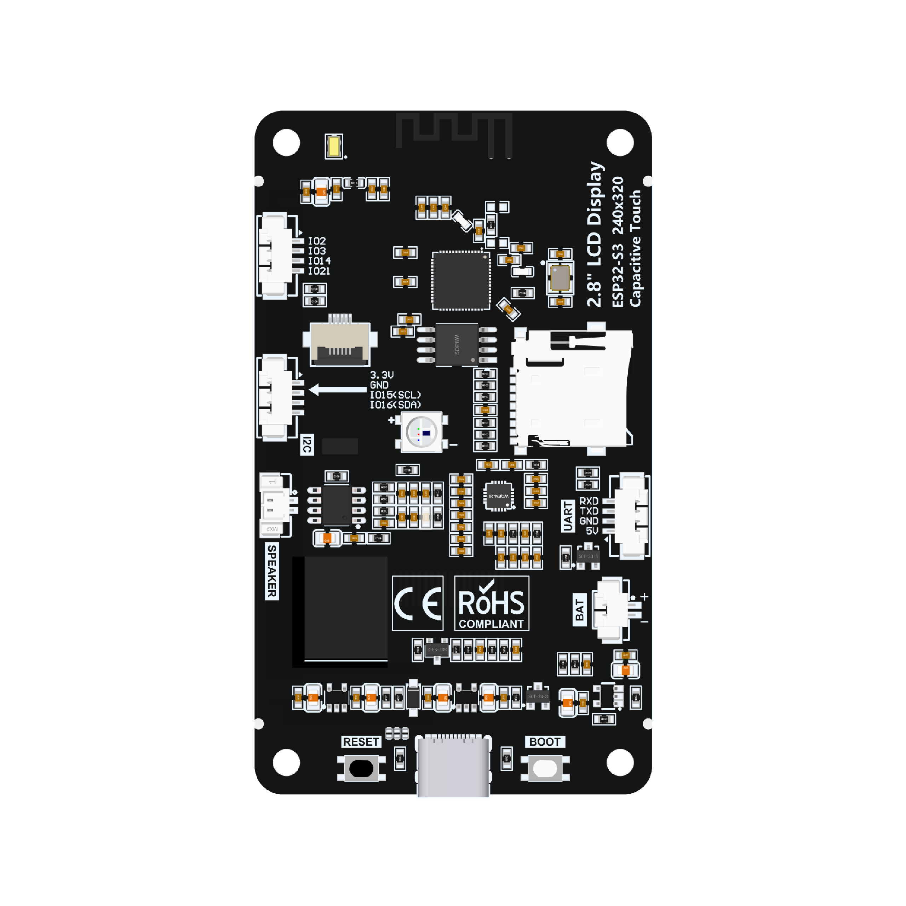

# 2.8inch ESP32-S3 Display (ES3N28P / ES3C28P)

- **Status**: Supported
- **Manufacturer**: LCD Wiki / Open-Smart / Makerbase
- **Wiki & Design Docs**: [https://www.lcdwiki.com/2.8inch_ESP32-S3_Display](https://www.lcdwiki.com/2.8inch_ESP32-S3_Display)
- **Schematic**: [Schematic.pdf](Schematic.pdf)

---

## 1. Hardware Specifications

| Component | Specification |
| :--- | :--- |
| **SoC** | ESP32-S3 (ESP32-S3R8) Dual-Core LX7 @ 240MHz |
| **Memory** | 512KB SRAM + **8MB Octal PSRAM (OPI)** |
| **Flash** | **16MB SPI Flash** (25VQ128) |
| **Display** | 2.8\" IPS TFT LCD, 240x320 (QD2833 / Controller: ILI9341V), SPI Interface |
| **Audio Codec** | ES8311 (I2S DAC/ADC, I2C Control @ `0x18`) |
| **Audio Amp** | SC8002B / FM8002E 3W Audio Amplifier (Shutdown pin active High, Low = Enable) |
| **Microphone** | MEMS Microphone (LMA2718B381-OA7) connected to ES8311 ADC |
| **Storage** | MicroSD Card slot via SDMMC / SPI |
| **RGB LED** | WS2812B Addressable RGB LED on GPIO42 |
| **Battery / Power** | TP4054 Li-ion Charger, ME6217 3.3V LDO, Type-C USB |
| **Battery ADC** | 200kΩ / 200kΩ (2:1) voltage divider on GPIO9 (ADC1_CH8) |
| **Buttons** | KEY1 (Reset / EN), KEY2 (GPIO0 / Boot) |
| **Gamepad** | 8-button Gamepad connected via PCF8574 (I2C @ `0x20`) on P4 I2C header |

---

## 2. PCF8574 I2C Gamepad Wiring Guide

Retro-Go includes native built-in support for **PCF8574** (`RG_I2C_GPIO_DRIVER 5`). The PCF8574 module is connected to the **P4** I2C header on the display board.

### A. I2C Bus Connection (ESP32-S3 Display to PCF8574)

```
    ┌─────────────────────────────┐           ┌─────────────────────────────┐
    │ ESP32-S3 Display (Header P4)│           │    PCF8574 Module (I2C)     │
    │                             │           │                             │
    │  [1] +5V (or 3.3V)          │──────────>│  VCC                        │
    │  [2] GND                    │──────────>│  GND                        │
    │  [3] IIC_SCL (GPIO 15)      │──────────>│  SCL                        │
    │  [4] IIC_SDA (GPIO 16)      │──────────>│  SDA                        │
    └─────────────────────────────┘           └─────────────────────────────┘
```

> **I2C Address Configuration (`0x20`)**:
> Tie all three address pins **`A0`, `A1`, `A2` to GND** (logic 0) to set the default I2C address to **`0x20`**.

---

### B. Gamepad Buttons Wiring (PCF8574 P0 - P7)

All buttons are configured as **Active Low (pulled to GND when pressed)**:
- Connect one terminal of each button to the corresponding **P0 - P7** pin on the PCF8574 module.
- Connect the other terminal of all buttons together to common **GND**.

```
    PCF8574 Pin           Gamepad Button              Wiring
   ┌───────────┐
   │    P0     │───────────[ D-Pad UP ]───────────────┐
   │    P1     │───────────[ D-Pad DOWN ]─────────────┤
   │    P2     │───────────[ D-Pad LEFT ]─────────────┤
   │    P3     │───────────[ D-Pad RIGHT ]────────────┼────> Common GND
   │    P4     │───────────[ Button A ]───────────────┤
   │    P5     │───────────[ Button B ]───────────────┤
   │    P6     │───────────[ Button SELECT ]──────────┤
   │    P7     │───────────[ Button START ]───────────┘
   └───────────┘
```

---

### C. System Virtual Shortcuts (Virtual Map)

| Retro-Go Function | Key Combination / Input Source | Notes |
| :--- | :--- | :--- |
| **MENU (Open in-game menu / Exit)** | **Press simultaneously: `SELECT` + `START`** | Or press onboard `KEY2 / BOOT` (GPIO 0) |
| **OPTION (Quick Options / Save)** | **Press simultaneously: `SELECT` + `A`** | Virtual combo |
| **RESET (System Reboot)** | Hardware button **`KEY1 / RESET`** on board | Connected to `CHIP_PU` |

---

### D. Dual PCF8574 Expansion Guide (Optional: 16 Buttons / L & R Support)

To add shoulder buttons (`L`, `R`), `X`, `Y`, or dedicated `MENU`/`OPTION` buttons, connect a second PCF8574 module in parallel on the same I2C bus (**Header P4**).

#### 1. Hardware Addressing & Bus Wiring
- Both modules share **VCC**, **GND**, **SCL (GPIO 15)**, and **SDA (GPIO 16)** in parallel.
- **Module 1 (`0x20`)**: Solder `A0=GND, A1=GND, A2=GND` (Primary 8 buttons: bit 0..7).
- **Module 2 (`0x21`)**: Solder `A0=VCC, A1=GND, A2=GND` (Secondary 8 buttons: bit 8..15).

```
    ESP32-S3 (Header P4)
    ├── SCL (IO15) ────────┬─── Module 1 SCL (0x20)
    │                      └─── Module 2 SCL (0x21)
    ├── SDA (IO16) ────────┬─── Module 1 SDA (0x20)
    │                      └─── Module 2 SDA (0x21)
    ├── +5V / 3.3V ────────┬─── Module 1 VCC
    │                      └─── Module 2 VCC
    └── GND ───────────────┴─── Common GND (all buttons & modules)
```

#### 2. Module 2 Pinout Mapping (Active Low to GND)
| PCF8574 #2 Pin | Bit Position | Gamepad Button |
| :---: | :---: | :--- |
| **P0** | Bit 8 | **Button L (Shoulder Left)** |
| **P1** | Bit 9 | **Button R (Shoulder Right)** |
| **P2** | Bit 10 | **Button X (SNES)** |
| **P3** | Bit 11 | **Button Y (SNES)** |
| **P4** | Bit 12 | **Dedicated MENU Button** |
| **P5** | Bit 13 | **Dedicated OPTION Button** |
| **P6 - P7** | Bit 14 - 15 | Reserved / Unused |

#### 3. Code Configuration (`config.h` & `rg_i2c.c`)
- In `config.h`, expand `RG_GAMEPAD_I2C_MAP`:
  ```c
  #define RG_GAMEPAD_I2C_MAP { \
      {RG_KEY_UP,     .num = 0,  .level = 0}, \
      {RG_KEY_DOWN,   .num = 1,  .level = 0}, \
      {RG_KEY_LEFT,   .num = 2,  .level = 0}, \
      {RG_KEY_RIGHT,  .num = 3,  .level = 0}, \
      {RG_KEY_A,      .num = 4,  .level = 0}, \
      {RG_KEY_B,      .num = 5,  .level = 0}, \
      {RG_KEY_SELECT, .num = 6,  .level = 0}, \
      {RG_KEY_START,  .num = 7,  .level = 0}, \
      {RG_KEY_L,      .num = 8,  .level = 0}, \
      {RG_KEY_R,      .num = 9,  .level = 0}, \
      {RG_KEY_MENU,   .num = 12, .level = 0}, \
      {RG_KEY_OPTION, .num = 13, .level = 0}, \
  }
  ```
- In `components/retro-go/rg_i2c.c`, update driver 5 (`PCF8574`) to define 2 ports with addresses `0x20` and `0x21` so `rg_i2c_gpio_read_port(0)` reads Module 1 and `rg_i2c_gpio_read_port(1)` reads Module 2. Retro-Go automatically combines both ports: `buttons = (data1 << 8) | data0` (`rg_input.c:143`).

---

### E. ESP32-C3 SuperMini Wireless Gamepad (ESP-NOW P2P)

Retro-Go includes native **ESP-NOW wireless gamepad support** (`RG_GAMEPAD_USE_ESPNOW 1`). You can build an ultra-low latency (< 3ms) wireless handheld controller using an **ESP32-C3 SuperMini** board communicating over 2.4GHz broadcast (zero-configuration pairing).

#### 1. Pinout Wiring (ESP32-C3 SuperMini to Buttons)
All buttons connect directly between the GPIO pin and **GND** (Active Low using internal pull-up):

| ESP32-C3 Pin | Gamepad Button | Retro-Go Key | Notes |
| :---: | :--- | :--- | :--- |
| **IO0** | **D-Pad UP** | `RG_KEY_UP` | Direction Up |
| **IO1** | **D-Pad DOWN** | `RG_KEY_DOWN` | Direction Down |
| **IO2** | **D-Pad LEFT** | `RG_KEY_LEFT` | Direction Left |
| **IO3** | **D-Pad RIGHT** | `RG_KEY_RIGHT` | Direction Right |
| **IO4** | **Button A** | `RG_KEY_A` | Action A (Jump / Accept) |
| **IO5** | **Button B** | `RG_KEY_B` | Action B (Attack / Cancel) |
| **IO6** | **Button X** | `RG_KEY_X` | SNES Button X |
| **IO7** | **Button Y** | `RG_KEY_Y` | SNES Button Y |
| **IO8** | **Button L** | `RG_KEY_L` | Shoulder Left |
| **IO10** | **Button R** | `RG_KEY_R` | Shoulder Right |
| **IO20** | **Button SELECT** | `RG_KEY_SELECT` | Select |
| **IO21** | **Button START** | `RG_KEY_START` | Start |
| **IO9** | **Button MENU** | `RG_KEY_MENU` | External switch wired to header pin 9 (do not use onboard SMD boot button) |
| **GND** | **Common Ground** | | Connect to all 13 switches |

> **Note on Simultaneous Inputs**:
> Connecting and using the wireless gamepad does not disable the console's onboard physical buttons (PCF8574/GPIO). Both input sources are aggregated simultaneously (`onboard | wireless`), allowing dual control or instant hot-swapping.

#### 2. Build & Flash Gamepad Firmware (ESP-IDF)
The pure ESP-IDF project is located at `tools/gamepad/` (supports ESP32-C3, ESP32-S3, ESP32):

```bash
# 1. Load ESP-IDF environment
. $HOME/esp/esp-idf/export.sh

# 2. Enter gamepad directory
cd tools/gamepad

# 3. Target ESP32-C3 (or esp32s3 / esp32) and compile
idf.py set-target esp32c3
idf.py build

# 4. Flash to ESP32-C3 SuperMini (1-step flash at offset 0x0)
esptool.py --chip esp32c3 -p /dev/ttyUSB1 -b 460800 write_flash 0x0 build/gamepad.img
```

The gamepad immediately transmits button states via ESP-NOW broadcast (`FF:FF:FF:FF:FF:FF`). The ES3N28P board receives packets seamlessly and works simultaneously alongside any onboard buttons.

---

## 3. GPIO Pinout Table

### Display (ILI9341V / SPI2)
| Function | GPIO | Notes |
| :--- | :---: | :--- |
| `LCD_CS` | **GPIO 10** | SPI Chip Select |
| `LCD_MOSI` (SDA) | **GPIO 11** | SPI Data Out |
| `LCD_CLK` (SCL) | **GPIO 12** | SPI Clock |
| `LCD_MISO` (SDO) | **GPIO 13** | SPI Data In |
| `LCD_RS` (DC) | **GPIO 46** | Register Select (High: Data, Low: Command) |
| `LCD_BL` | **GPIO 45** | Backlight control (Active High via BSS138/Q4) |
| `RESET` | `CHIP_PU` | Hardware reset wired to system reset |

### Audio (ES8311 + SC8002B)
| Function | GPIO | Notes |
| :--- | :---: | :--- |
| `AUDIO_EN` (Amp Enable) | **GPIO 1** | SC8002B SHUTDOWN pin (Active Low to enable amp) |
| `I2S_MCK` | **GPIO 4** | Master Clock to ES8311 |
| `I2S_SCK` (BCLK) | **GPIO 5** | Bit Clock |
| `I2S_DO` (DATA Out) | **GPIO 6** | Audio Data Out to ES8311 DAC (`DSDIN`) |
| `I2S_LRC` (WS) | **GPIO 7** | Word Select / Frame Clock |
| `I2S_DI` (DATA In) | **GPIO 8** | Audio Data In from ES8311 ADC (`ASDOUT` / Mic) |

### I2C Bus (Shared)
| Function | GPIO | Notes |
| :--- | :---: | :--- |
| `I2C_SCL` | **GPIO 15** | Onboard 4.7kΩ pull-up |
| `I2C_SDA` | **GPIO 16** | Onboard 4.7kΩ pull-up |
| *Devices* | | ES8311 (`0x18`), Touch/CTP (`0x38`), Extender (`0x20`) |

### MicroSD Card (SDMMC)
| Function | GPIO | Notes |
| :--- | :---: | :--- |
| `SD_CLK` | **GPIO 38** | 10kΩ pull-up |
| `SD_D0` | **GPIO 39** | 10kΩ pull-up |
| `SD_CMD` | **GPIO 40** | 10kΩ pull-up |
| `SD_D1` | **GPIO 41** | 10kΩ pull-up |
| `SD_D2` | **GPIO 48** | 10kΩ pull-up |
| `SD_D3` | **GPIO 47** | 10kΩ pull-up |

### Onboard Headers Layout
```
               REAR VIEW OF ESP32-S3 DISPLAY BOARD
 ┌─────────────────────────────────────────────────────────┐
 │                                                         │
 │   [JP1 - BATTERY]      [P4 - I2C]        [P3 - EXT IO]  │
 │    1. BAT+ (3.7V)       1. +5V            1. 3.3V       │
 │    2. GND               2. GND            2. GND        │
 │                         3. SCL (IO15)     3. IO2        │
 │                         4. SDA (IO16)     4. IO3        │
 │                                           5. IO14       │
 │   [JP3 - SPEAKER]      [P2 - UART]        6. IO21       │
 │    1. SP+               1. +5V                          │
 │    2. SP- (Amp SC8002)  2. GND                          │
 │                         3. TX0 (IO43)                   │
 │                         4. RX0 (IO44)                   │
 └─────────────────────────────────────────────────────────┘
```

---

## 4. Build & Flash Instructions

Retro-Go is composed of multiple sub-applications (Launcher UI + 4 emulator/game cores):
1. **`launcher`**: Main system menu, file browser, audio/display settings, and save-state manager.
2. **`retro-core`**: Multi-system emulator (NES, SNES, Game Boy, Game Boy Color, Game & Watch, Sega Master System, Game Gear, PC Engine, ColecoVision, Atari Lynx).
3. **`gwenesis`**: Sega Genesis / Mega Drive emulator.
4. **`prboom-go`**: Doom & Doom II engine port.
5. **`fmsx`**: MSX / MSX2 home computer emulator.

---

### Recommended: One-Step Build & Flash (All-in-One)
The `install` command automatically compiles all 5 applications, generates the bootloader and partition table, packs everything into a single `.img` flash binary, and flashes it directly to the board at offset `0x0`:

```bash
# 1. Load ESP-IDF environment
. $HOME/esp/esp-idf/export.sh

# 2. Build everything and flash in one step
./rg_tool.py --target es3n28p --port /dev/ttyUSB0 install
```

---

### Alternative: Build Standalone Flash Image (.img)
If you want to build the complete image without connecting the device:
```bash
./rg_tool.py --target es3n28p build-img
```
This produces `retro-go_<version>_es3n28p.img` containing the entire flash image (Bootloader + Partition Table + All 5 Apps). You can flash it anytime using `esptool.py`:
```bash
esptool.py --chip esp32s3 -p /dev/ttyUSB0 -b 921600 write_flash 0x0 retro-go_*_es3n28p.img
```

---

### Serial Console Monitoring
```bash
./rg_tool.py --target es3n28p --port /dev/ttyUSB0 monitor
```

---

## 5. MicroSD Card Setup

Format your MicroSD Card with **FAT32** and create the directory structure:

```
/sd/
├── retro-go/
│   ├── bios/       # Optional BIOS files (gb, gbc, fds, msx)
│   └── saves/      # Save states and SRAM (auto-created)
├── romart/         # Cover artwork (e.g. /romart/nes/<gamename>.png)
└── roms/
    ├── nes/        # .nes, .fds, .nsf, .zip
    ├── snes/       # .smc, .sfc, .zip
    ├── gb/         # .gb, .gbc, .zip
    ├── gbc/        # .gbc, .gb, .zip
    ├── gw/         # .gw (Game & Watch)
    ├── md/         # .md, .gen, .bin, .zip (Mega Drive / Genesis)
    ├── sms/        # .sms, .sg, .zip (Master System / SG-1000)
    ├── gg/         # .gg, .zip (Game Gear)
    ├── pce/        # .pce, .zip (PC Engine / TurboGrafx-16)
    ├── col/        # .col, .rom, .zip (ColecoVision)
    ├── lnx/        # .lnx, .zip (Atari Lynx)
    ├── doom/       # .wad, .zip
    └── msx/        # .rom, .mx1, .mx2, .dsk
```

---

## 6. Images

### Front View


### Back View
